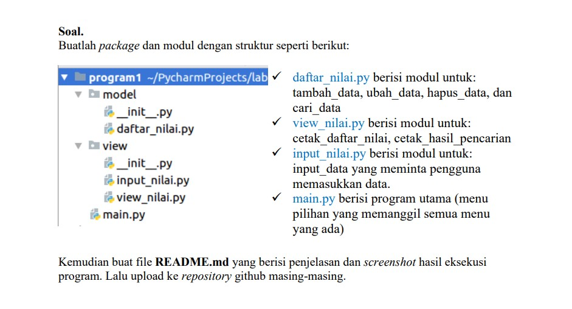
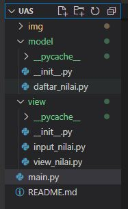
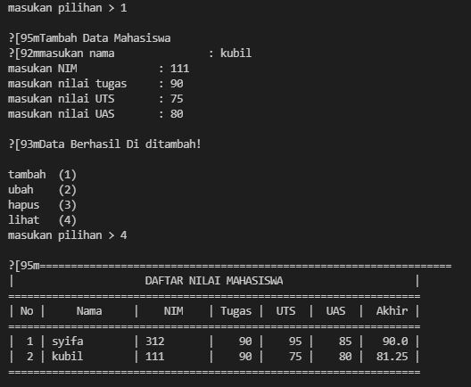
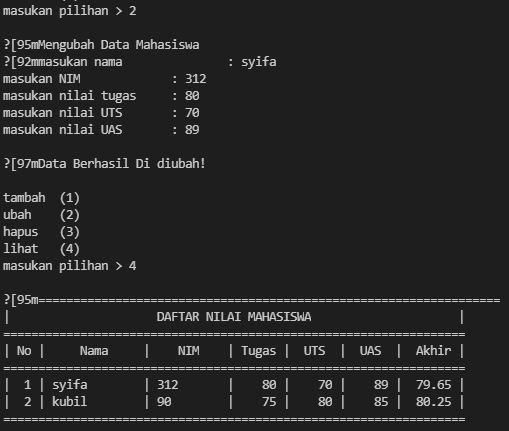
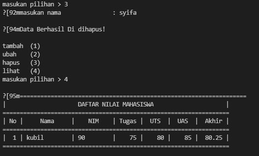
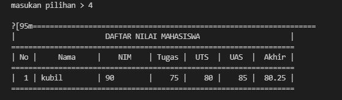

# UAS SEMESTER 1


## Nama  : Zahra Syifa Annisa
## Kelas : T1.21.C5
## NIM   : 312110458

## SOAL 

Pada UAS di pertemuan ke-16 ini,saya diberikan beberapa tugas oleh dosen saya,yaitu : 



dan ini adalah hasil package yang sudah saya buat.



## SOAL 1 (Daftar_Nilai)

Tentang pertama,di bawha ini saya telah menyantumkan beberapa sintaks yang nantinya akan menghasilkan
semua modul dari paket Daftar_Nilai yang diantaranya adalah (Tambah Data,Ubah Data,Hapus Data,dan Cari Data)

```py
from view.input_nilai import *
data={}
class daftarNilai():
    def tambah_data(self):
        print('\n\033[95mTambah Data Mahasiswa')
        nambah_nama = nama()
        nambah_nim = nim()
        nambah_tugas = tugas()
        nambah_uts = uts()
        nambah_uas = uas()
        nambah_akhir = akhir()
        data[nambah_nama]=nambah_nim,nambah_tugas,nambah_uts,nambah_uas,nambah_akhir
        print('\n\033[93mData Berhasil Di ditambah!\n')
        
    def ubah_data(self):
        print('\n\033[95mMengubah Data Mahasiswa')
        ubah_nama = nama()
        if ubah_nama in data.keys():
            nambah_nim = nim()
            nambah_tugas = tugas()
            nambah_uts = uts()
            nambah_uas = uas()
            nambah_akhir = akhir()
            data[ubah_nama]=nambah_nim,nambah_tugas,nambah_uts,nambah_uas,nambah_akhir
            print('\n\033[97mData Berhasil Di diubah!\n')
        else:
            print('data tidak ditemukan !!!')  
    def hapus_data(self):
        hapus_nama = nama()
        if hapus_nama in data.keys():
            del data[hapus_nama]
            print('\n\033[94mData Berhasil Di dihapus!\n')
        else:
            print('data tidak ditemukan !!!')  
            
    
    def keluar(self):
        print('thank you')
```
Disini saya akan mencoba menguraikannya.Pertama untuk menghasilkan modul **Tambah Data** kamu perlu
memasukkan sintaks di bawah ini.

```py
def tambah_data(self):
        print('\n\033[95mTambah Data Mahasiswa')
        nambah_nama = nama()
        nambah_nim = nim()
        nambah_tugas = tugas()
        nambah_uts = uts()
        nambah_uas = uas()
        nambah_akhir = akhir()
        data[nambah_nama]=nambah_nim,nambah_tugas,nambah_uts,nambah_uas,nambah_akhir
        print('\n\033[93mData Berhasil Di ditambah!\n')
```

Jadi kesimpulannya jika kalian menggunakan semua sintaks yang saya tunjukkan di awal dan memasukkan **'1'**
pada kolom yang tersedia dan kalian jalankan, maka akan mendapat output seperti di bawah ini, yang mana itu
adalah hasil untuk menambahkan data.



Kedua untuk menghasilkan modul **Ubah Data** kamu perlu memasukkan sintaks di bawah ini.

```py
def ubah_data(self):
        print('\n\033[95mMengubah Data Mahasiswa')
        ubah_nama = nama()
        if ubah_nama in data.keys():
            nambah_nim = nim()
            nambah_tugas = tugas()
            nambah_uts = uts()
            nambah_uas = uas()
            nambah_akhir = akhir()
            data[ubah_nama]=nambah_nim,nambah_tugas,nambah_uts,nambah_uas,nambah_akhir
            print('\n\033[97mData Berhasil Di diubah!\n')
        else:
            print('data tidak ditemukan !!!')
```

Jadi kesimpulannya jika kalian menggunakan semua sintaks yang saya tunjukkan di awal dan memasukkan **'2'** 
pada kolom yang tersedia dan kalian jalankan, maka akan mendapat output seperti di bawah ini, yang dimana itu
adalah hasil untuk mengubah data.



Ketiga untuk menghasilkan modul **Hapus Data** kamu perlu memasukkan sintaks dibawah ini.

```py
def hapus_data(self):
        hapus_nama = nama()
        if hapus_nama in data.keys():
            del data[hapus_nama]
            print('\n\033[94mData Berhasil Di dihapus!\n')
        else:
            print('data tidak ditemukan !!!')  
```

Jadi kesimpilannya jika kalian menggunakan semua sintaks yang saya tunjukkan di awal dan
memasukkan **'3'** pada kolom yang tersedia dan kalian jalankan, maka akan mendapat output 
seperti dibawah ini, dimana itu adalah hasil untuk menghapus data.



Untuk mencari data itu sendiri kalian hanya perlu memasukkan inisial dari modul tersebut.
Anggap saja kalian ingin mencari modul untuk Menghapus Data, maka kamu hanya perlu memasukkan angka **'3'**
pada kolom yang tersedia.

## SOAL 2(View_Nilai)

Untuk menjawab soal nomer 2,kalian perlu mengetikan angka **'4'** pada kolom yang di sediakan untuk melihat hasil pencarian
atau daftar nilai. Maka nanti akan mendapatkan hasil output seperti gambar di bawah ini.



## SOAL 3(Input_Nilai)
Pada soal ke-3 ,jiak kalian ingin memasukkan suatu data yaitu sama seperti kalian memasukkan angka **'1'** untuk menambahkan suatu data.Dan hasil output yang dihasilkan pun sama yaitu sebagai berikut.


## TERIMAKASIH